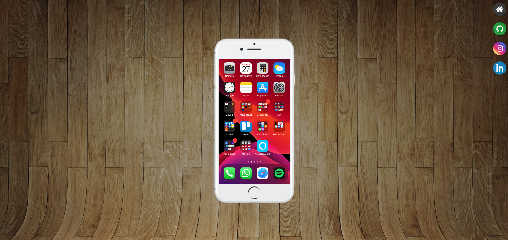

# Projeto Social

Projeto de front-end criado para aplicar conceitos de HTML, CSS e JavaScript.
O site simula uma interface voltada para um projeto social.

  

## Tecnologias
- HTML5
- CSS3
- JavaScript

## Funcionalidades
- Página principal informativa
- Navegação clara entre seções
- Conteúdo organizado

## O que eu aprendi
- Desenvolvimento de página informativa estruturada
- Uso de HTML5 para organização semântica do conteúdo
- Estilização com CSS3 para construção de layout
- Organização visual com foco em experiência do usuário
- Deploy e versionamento utilizando GitHub

## Visite
https://erasmo-jr.github.io/projeto-social/
